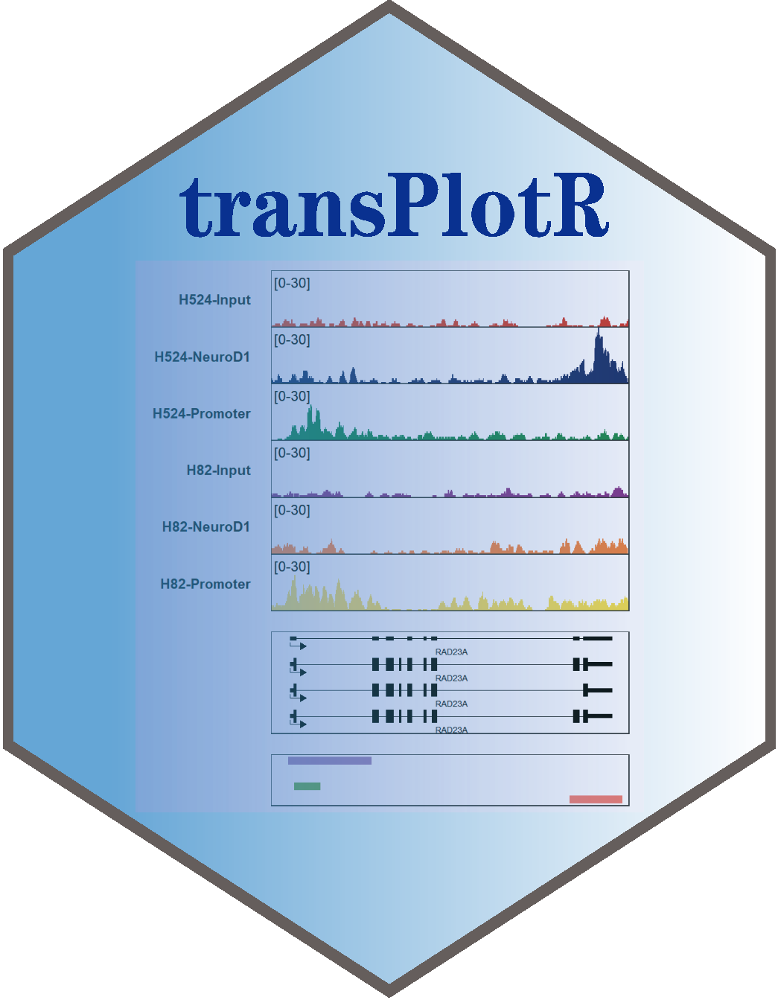

# transPlotR 

<!-- badges: start -->

There  are some packages to plot gene structures, for example [**ggbio**](https://bioconductor.org/packages/release/bioc/html/ggbio.html), [**ggtranscript**](https://github.com/dzhang32/ggtranscript)... But there are still some limitations for them. The **IGV** software provides a good visualization for gene multiple isoforms. If you want to plot **protein-coding** or **non-coding genes**, it seems a little bit difficult for you to draw with a lot of codes. Here I developed a small R package named [**transPlotR**](https://github.com/junjunlab/transPlotR) which makes gene structure visualization much easier. You can provide a little parameters to **trancriptVis** to make a plot with your own **GTF** files.

Besides, **bedVis** and **trackVis** functions can be used to visualize bed and bigwig files with combing **transcriptVis** function. All these functions will let you produce a nice track plot for some Chip-seq, ATAC-seq and m6A-seq datasets.

<!-- badges: end -->

## Installation

You can install the development version of transPlotR like so:

``` r
# install.packages("devtools")
devtools::install_github("junjunlab/transPlotR")
```

**Requirement:**

> - **rtracklayer**, **ggarchery**, **geomtextpath**, **ggnewscale**, **purrr**

## Citation

> Jun Z (2022). *transPlotR: An elegant package to visualize gene structures.*  https://github.com/junjunlab/transPlotR, https://github.com/junjunlab/transPlotR/wiki/TransPlot-documentation

## Figure


## More examples

> - **https://github.com/junjunlab/transPlotR/wiki/TransPlot-documentation**
> - **https://github.com/junjunlab/transPlotR/wiki/TransPlot-0.0.3-documentation**

## Related blogs

> - [**transPlotR 优雅的绘制基因转录本结构**](https://mp.weixin.qq.com/s?__biz=MzkyMTI1MTYxNA==&mid=2247501734&idx=1&sn=d03029b38bfbeda067109bc477bdffa7&chksm=c184fdd7f6f374c1edb12bec9e741834f8adb59ed336730438dc275794520f63f0889e91d2aa&token=503374955&lang=zh_CN#rd)
> - [**trancriptVis 的左膀右臂: bedVis 和 trackVis**](https://mp.weixin.qq.com/s?__biz=MzkyMTI1MTYxNA==&mid=2247505845&idx=1&sn=837625700fb274c83d16de7102f6ed55&chksm=c184edc4f6f364d25de9376ac41d9582f357f11e56a3d366d381c04fa9a5592d5f223b575814&token=503374955&lang=zh_CN#rd)
> - [**linkVis 可视化基因位点连接**](https://mp.weixin.qq.com/s?__biz=MzkyMTI1MTYxNA==&mid=2247505905&idx=1&sn=9ec3ccfc72d1f4889596099fdb1ba67f&chksm=c184ed80f6f3649603c3a6a21ff1e324f028b34d21064b5fd9f4a38c1dca4578a61d6698c582&token=503374955&lang=zh_CN#rd)
> - [**trackVis 给 track 加个背景色**](https://mp.weixin.qq.com/s?__biz=MzkyMTI1MTYxNA==&mid=2247505942&idx=1&sn=41c5ada6cca8e550f54e2517ec82889e&chksm=c184e267f6f36b711ba10c8e4c4e547e5a34f901ad07c50150e27b88a14d715bd9184b728be9&token=503374955&lang=zh_CN#rd)
> - [**trancriptVis 可视化 NCBI 的 GTF 文件**](https://mp.weixin.qq.com/s?__biz=MzkyMTI1MTYxNA==&mid=2247506038&idx=1&sn=3799e20c5f29989bf60ab55b9ca02420&chksm=c184e207f6f36b1171c423da6caf9e7f299d16b5273d3b26482b8662b20b43a004e6324ee878&token=503374955&lang=zh_CN#rd)
> - [**trackVis 在图里添加样本标签**](https://mp.weixin.qq.com/s?__biz=MzkyMTI1MTYxNA==&mid=2247506082&idx=1&sn=3db6fded3ae1c35ad1750f538419ddba&chksm=c184e2d3f6f36bc5533a7343f47150954fe4ac478ba3b61aee466b8286c2869678b6d10ccbcb&token=503374955&lang=zh_CN#rd)
> - [**trackVis 给样本加个分组注释**](https://mp.weixin.qq.com/s?__biz=MzkyMTI1MTYxNA==&mid=2247506176&idx=1&sn=1dad4695f275d68104db5b6929bffebf&chksm=c184e371f6f36a67108993c2baaf442d001e00622216073f8ee2d7d8211a585292352e54f836&token=503374955&lang=zh_CN#rd)
> - [**trackVis 居然可以自由修改 Y 轴范围**](https://mp.weixin.qq.com/s?__biz=MzkyMTI1MTYxNA==&mid=2247506218&idx=1&sn=a3f9b773e0b6a764732198866fb23f3e&chksm=c184e35bf6f36a4de62754ac01c901c384859a3fb675a2bec84684daddb3c64a7f429e7bb63e&token=503374955&lang=zh_CN#rd)
> - [**trackVis 修改样本顺序和分组顺序**](https://mp.weixin.qq.com/s?__biz=MzkyMTI1MTYxNA==&mid=2247506440&idx=1&sn=7dd1e5cdaf52f7bba1716d5e9c06b08c&chksm=c184e079f6f3696f61840142474ff2257a4550dd0cf1792cbf479fda4c45c71fbd1d651b2c11&token=503374955&lang=zh_CN#rd)
